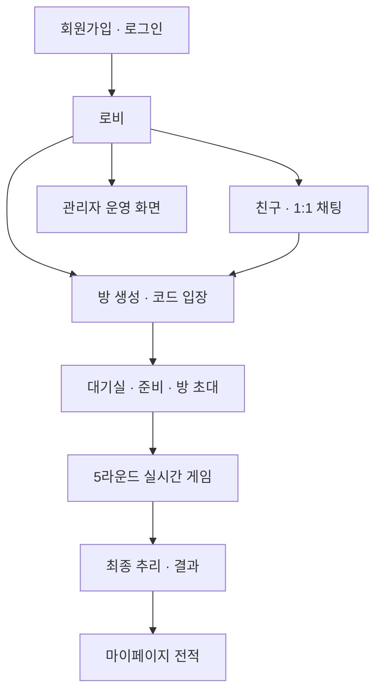
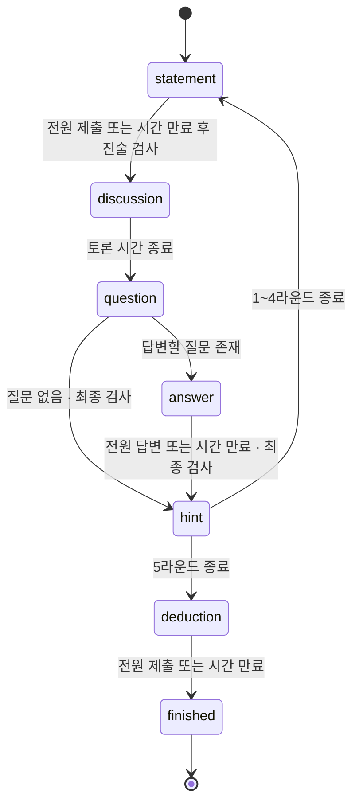
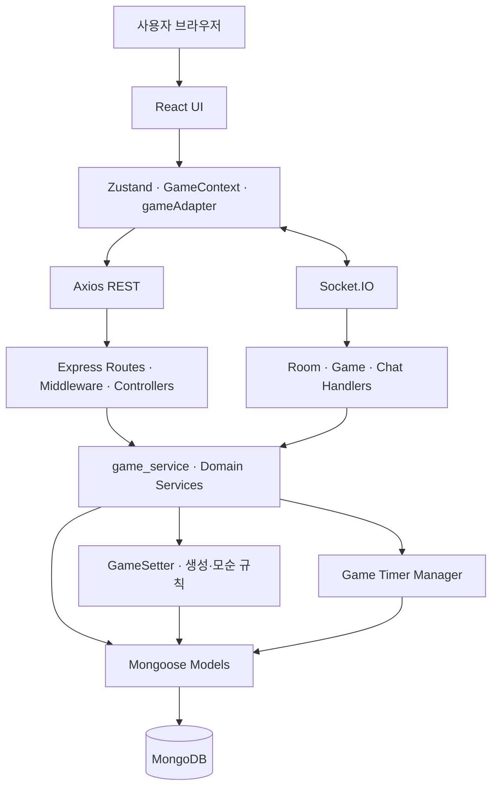
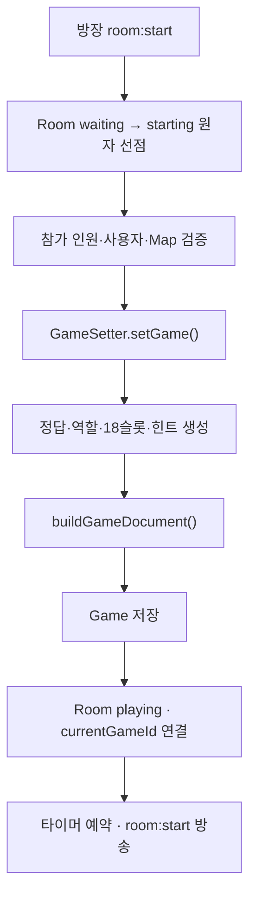
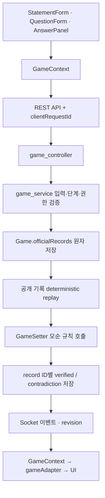
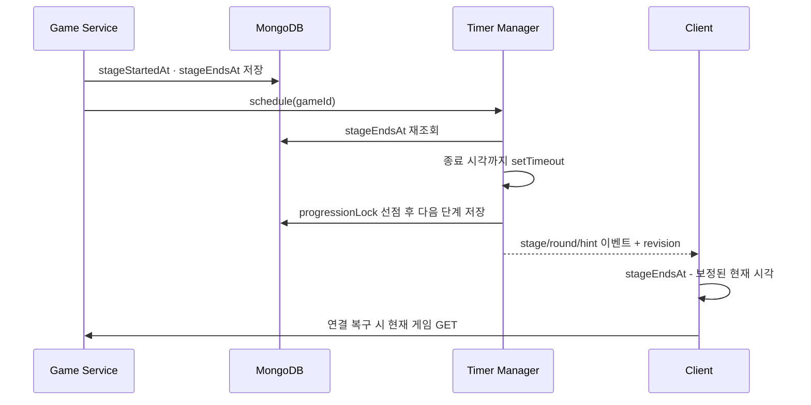
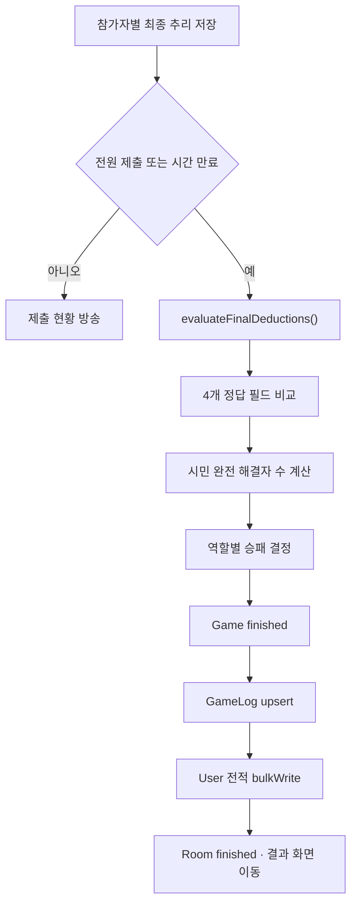

# ALIBI — TRUST NO ALIBI

> 서로의 진술을 믿을 것인가, 모순을 추적할 것인가.

ALIBI는 플레이어의 알리바이와 공식 질의응답을 구조화된 기록으로 수집하고, 공개된 기록 사이의 논리적 모순을 서버가 판정하는 실시간 멀티플레이 추리 게임입니다. 플레이어는 5개 라운드 동안 자신의 일부 행적을 공개하고 서로에게 질문하며, 단계별 힌트를 바탕으로 범인·범행 시각·장소·도구를 추리합니다.

단순한 채팅형 추리 게임이 아니라 다음 문제를 웹 시스템으로 구현하는 것이 핵심 목표였습니다.

- 매 게임마다 정답·역할·동선·힌트가 달라지는 사건 생성
- 자유로운 거짓말을 비교 가능한 공식 JSON 기록으로 변환
- 공식 진술과 YES/NO 답변을 누적해 모순을 재현 가능하게 판정
- 여러 사용자가 동시에 제출해도 중복 저장·중복 단계 전환 방지
- 서로 다른 PC에서도 같은 종료 시각을 바라보는 서버 주도 타이머
- 정답과 개인 타임라인을 다른 참가자에게 노출하지 않는 사용자별 응답

이 프로젝트는 백엔드 알고리즘 설계 및 계산 로직을 공부하기 위한 **6인 팀 프로젝트**이며, 본 저장소는 프론트엔드·백엔드·데이터 모델·제출 문서를 통합한 최종 제출본입니다.

---

## 목차

1. [프로젝트 한눈에 보기](#프로젝트-한눈에-보기)
2. [서비스 전체 흐름](#서비스-전체-흐름)
3. [구현 기능](#구현-기능)
4. [게임 규칙과 라운드](#게임-규칙과-라운드)
5. [시스템 아키텍처](#시스템-아키텍처)
6. [핵심 동작 원리](#핵심-동작-원리)
7. [핵심 코드 지도](#핵심-코드-지도)
8. [데이터베이스 구조](#데이터베이스-구조)
9. [API와 실시간 이벤트](#api와-실시간-이벤트)
10. [프로젝트 구조](#프로젝트-구조)
11. [주요 문제와 해결](#주요-문제와-해결)
12. [시연 빌드 안내](#시연-빌드-안내)

---

## 프로젝트 한눈에 보기

| 항목 | 내용 |
| --- | --- |
| 프로젝트명 | ALIBI — TRUST NO ALIBI |
| 형태 | 실시간 멀티플레이 웹 추리 게임 |
| 프로젝트 구성 | 6인 팀 프로젝트 |
| 핵심 플레이 | 공식 진술 → 모순검사 → 토론 → 공식 질문 → 공식 답변 → 최종 모순검사 → 힌트 |
| 게임 규모 | 5라운드, 장소 12곳, 6시간·18개 시간 슬롯, 사용 도구 최대 8개 |
| 핵심 추리 | 범인·범행 시각·범행 장소·범행 도구 4개 항목 |
| 통신 방식 | REST API로 공식 기록 저장, Socket.IO로 상태 변경·채팅·진행 이벤트 전달 |
| 데이터베이스 | MongoDB 10개 주요 컬렉션, 게임 한 판 단위 스냅샷 저장 |
| API | REST 41개 엔드포인트 + 대기방·게임·채팅 Socket 이벤트 |

### 기술 스택

| 구분 | 기술 | 사용 목적 |
| --- | --- | --- |
| Frontend | React , Vite | SPA 화면과 컴포넌트 구성 |
| Routing | React Router | 공개·인증·관리자 라우트 분리 |
| Client State | Zustand, Context API | 인증 상태와 게임 상태 관리 |
| HTTP | Axios | JWT가 포함된 REST 요청 |
| Realtime | Socket.IO Client / Server | 대기방, 채팅, 게임 진행 이벤트 |
| Backend | Node.js, Express | REST API와 게임 서버 |
| Validation / Auth | AJV, JWT, bcrypt | 입력 검증, 인증, 비밀번호 해싱 |
| Database | MongoDB, Mongoose | 게임 문서·사용자·채팅·결과 저장 |
| Test | Node.js Test Runner, ESLint | 생성 규칙·모순검사·게임 흐름 회귀 검증 |

---

## 서비스 전체 흐름



### 화면과 사용자 경험

| 경로 | 화면 | 주요 기능 |
| --- | --- | --- |
| `/` | 로그인 | 아이디·비밀번호 로그인, JWT 발급 |
| `/signup` | 회원가입 | 아이디·닉네임·비밀번호 검증 및 가입 |
| `/lobby` | 로비 | 방 목록, 방 생성·입장, 친구·요청·1:1 채팅 |
| `/waiting-room/:roomId` | 대기실 | 참가자·방장·준비 상태, 채팅, 친구 초대, 게임 시작 |
| `/game/:gameId` | 메인 게임 | 사건 브리핑, 개인 타임라인, 공식 기록, 추리 보드, 힌트, 채팅 |
| `/result/:gameId` | 결과 | 사건 정답, 참가자별 추리 결과와 승패 |
| `/mypage` | 마이페이지 | 프로필·비밀번호 변경, 전적과 최근 게임 |
| `/admin` | 관리자 | 대시보드, 회원 권한, 게임 상태·강제 종료, 운영 로그 |

---

## 구현 기능

### 1. 인증·회원

- AJV 스키마를 적용한 회원가입·로그인 입력 검증
- bcrypt 기반 비밀번호 해싱 및 비교
- JWT 발급과 `Authorization: Bearer <JWT>` 인증
- 공개 라우트, 로그인 보호 라우트, 관리자 라우트 분리
- 닉네임 수정, 현재 비밀번호 확인, 비밀번호 변경
- 일반 사용자·관리자 역할 변경과 접근 권한 검사
- 전체·시민·범인 플레이 수, 승·패, 완전 해결 통계 누적

### 2. 친구·1:1 채팅

- 사용자 검색과 친구 요청 전송
- 받은 요청·보낸 요청 조회, 수락·거절·삭제
- 친구 관계 사용자만 1:1 채팅방 생성 가능
- 두 사용자 ID를 정렬한 `participantKey`로 중복 채팅방 방지
- 메시지 이력 조회와 Socket.IO 실시간 새 메시지 수신
- 방장이 1:1 채팅으로 대기방 초대 메시지 전송

### 3. 로비·대기실

- 공개 방 목록 조회와 최대 30자 방 생성
- `ALB-XXXX` 형식의 고유 초대 코드 발급
- 방 카드 입장과 초대 코드 입장
- 최대 인원·중복 참가·방 상태를 하나의 원자적 조건으로 검사
- 방장, 참가자, 현재 인원, 준비 인원 실시간 동기화
- 대기실 자유 채팅 저장과 재입장 시 이력 복원
- 방장만 게임 시작·방 삭제 가능
- `waiting → starting → playing → finished` 방 상태 관리

### 4. 사건 자동 생성

`backend/GameSetter.js`가 매 게임마다 다음 값을 생성합니다.

- 범인 역할, 범행 시각, 범행 장소, 범행 도구
- 참가자별 역할과 6시간·18개 슬롯의 실제 타임라인
- 슬롯별 장소·행동·소지 도구와 동행·목격 관계
- 실제 범행 도구를 포함한 사용 도구 목록 최대 8개
- 단계적으로 정답 범위를 줄이는 5개 라운드 힌트
- 범행 시간대에 배치되는 혼란 정보와 의심 단서

생성 과정에서는 동일 슬롯·동일 장소 최대 2명, 동일 도구 중복 소유 금지, 범행 슬롯의 범인 단독 배치, 동행 정보 정합성 같은 hard rule을 검증합니다.

### 5. 메인 게임

- 로그인 사용자에게만 자신의 역할과 전체 개인 타임라인 공개
- 사건 브리핑, 장소 지도, 역할 카드, 라운드 내비게이션
- 라운드 조건에 맞는 공식 진술 폼
- 장소·목격·도구 유형의 공식 질문과 YES/NO 답변
- 공개 기록을 시간순으로 표시하는 공식 기록 피드
- 모순이 발견된 진술·답변의 상태와 연결 기록 표시
- 시간 × 플레이어 형태의 공개 추리 보드
- 잠금·공개 상태가 구분되는 라운드 힌트
- 대기실 채팅을 이어받는 게임 자유 채팅
- 방장 전용 시연 시간 스킵

### 6. 서버 주도 진행

- MongoDB의 `stage`, `currentRound`, `stageEndsAt`을 기준으로 진행
- 마지막 제출 완료 시 타이머를 기다리지 않고 다음 단계로 즉시 전환
- 제한 시간 만료 시 미답변 질문을 `timed_out`으로 닫고 다음 단계 진행
- 질문이 없으면 빈 답변 단계를 기다리지 않고 라운드 검사·힌트로 이동
- 5라운드 힌트 종료 후 최종 추리 단계 진입
- `progressionLock`으로 마지막 제출과 타이머의 동시 전환 충돌 방지

### 7. 최종 판정·결과

- 범인·시각·장소·도구 네 필드를 각각 비교
- 네 필드를 모두 맞힌 시민만 완전 해결자로 계산
- 시민 완전 해결자가 5명 이상이면 시민 진영 승리
- 시민 완전 해결자가 4명 이하면 범인 진영 승리
- `Game` 종료 상태, `GameLog`, 사용자 전적, `Room` 상태 갱신
- 방이 이후 삭제돼도 `GameLog`와 게임 스냅샷으로 결과 재조회

### 8. 관리자

- 전체 사용자 수, 관리자 수, 실시간 접속 사용자 수, 진행 게임 수 조회
- 사용자 목록·권한 변경
- 현재 방과 과거 게임 상태 통합 조회
- 진행 중인 게임 강제 종료 및 상태 `forced` 기록
- 방 생성·입장·게임 강제 종료 등 최근 운영 로그 추적

---

## 게임 규칙과 라운드

### 기본 규칙

| 항목 | 규칙 |
| --- | --- |
| 기획 권장 인원 | 9~10명 |
| 시연 빌드 허용 인원 | 2~10명 |
| 장소 | 12곳 |
| 타임라인 | 연속 6시간 × 시간당 20분 슬롯 3개 = 18슬롯 |
| 동일 장소 | 같은 슬롯에 최대 2명 |
| 동행자 | 한 진술에 최대 1명 |
| 사용 도구 | 실제 범행 도구를 포함해 최대 8개 |
| 공식 질문 | 플레이어당 라운드 1회, 게임 전체 최대 5회 |
| 질문 유형 | `PRESENCE`, `WITNESS`, `ITEM_POSSESSION` |
| 최종 정답 | 범인·범행 시각·범행 장소·범행 도구 |

### 공통 라운드 흐름



`checking`은 데이터 모델에 존재하는 검사 상태이지만, 현재 진행 서비스는 검사를 서버 내부 처리로 완료한 뒤 다음 사용자 단계로 전환합니다.

### 라운드별 제출과 힌트

| 라운드 | 공식 제출 | 서버 검증 범위 | 종료 후 공개 힌트 |
| --- | --- | --- | --- |
| 1 | 전체 18슬롯 중 자유 알리바이 | 실제 장소·행동·시간 슬롯, 동행자 최대 1명 | 범행 장소를 포함한 후보 장소 6곳 |
| 2 | 후보 장소 6곳 중 알리바이 | 1라운드 공개 후보 장소인지 검사 | 범행 시간을 포함한 연속 3시간·9슬롯 |
| 3 | 후보 시간대 안의 알리바이 | 공개된 최대 3시간 범위인지 검사 | 실제 범행 도구의 특징 |
| 4 | 도구 소지 진술 | 이번 게임의 사용 도구인지 검사 | 1라운드 후보 중 최종 장소 3곳 |
| 5 | 최종 후보 장소 안의 알리바이 | 공개된 최종 장소 후보인지 검사 | 범행 시각을 포함한 핵심 시간 5슬롯 |

게임은 거짓 진술을 허용합니다. 따라서 서버는 공식 기록을 실제 비밀 타임라인과 대조해 진실·거짓을 알려주지 않습니다. **오직 플레이어에게 공개된 기록끼리 동시에 성립할 수 있는지**를 검사합니다.

---

## 시스템 아키텍처



### 계층별 책임

| 계층 | 책임 |
| --- | --- |
| React Page / Component | 사용자 입력과 화면 출력, 현재 단계에 맞는 UI 구성 |
| `GameContext.jsx` | 최초 상태 조회, REST 제출, Socket 구독, 서버 시간 보정, 화면 공용 상태 제공 |
| `gameAdapter.js` | 백엔드 DTO를 플레이어·피드·힌트·추리보드용 UI 모델로 변환 |
| REST API | 공식 진술·질문·답변·추리처럼 반드시 저장돼야 하는 명령 처리 |
| Socket.IO | 대기방·채팅·단계 변경·힌트·제출 현황을 참가자에게 실시간 전달 |
| Controller | HTTP 요청·응답과 Socket 방송 연결, 오류 형식 통일 |
| `game_service.js` | 게임 시작, 제출 검증·저장, 진행, 모순검사 orchestration, 최종 판정 |
| `GameSetter.js` | 사건 생성과 장소·도구·Q&A·목격 모순 규칙의 Source of Truth |
| `game_timer_service.js` | `stageEndsAt` 예약, 만료 단계 처리, 다음 타이머 재등록 |
| Mongoose Model | 게임 스냅샷·공식 기록·결과·사용자·방·채팅 영속화 |

### REST와 Socket을 함께 사용하는 이유

- 공식 기록은 유실되면 안 되므로 REST 요청의 성공·실패 응답을 기준으로 저장합니다.
- 다른 참가자가 즉시 변화를 알아야 하므로 저장 후 Socket으로 이벤트를 방송합니다.
- Socket 이벤트가 누락되거나 연결이 끊기면 `GET /api/games/:gameId`로 MongoDB의 최신 상태를 복원합니다.
- 따라서 Socket은 영구 상태 자체가 아니라 **변경 알림과 빠른 동기화 통로**이고, 최종 기준은 MongoDB입니다.

---

## 핵심 동작 원리

### 1. 게임 시작과 사건 생성



`startGame()`은 방 상태를 먼저 `starting`으로 선점합니다. 동시에 시작 버튼이 여러 번 눌려도 첫 요청 하나만 사건 생성기로 진입합니다. 생성 또는 저장이 실패하면 방을 다시 `waiting`으로 되돌려 재시작할 수 있게 합니다.

`buildGameDocument()`는 생성 결과를 공개 데이터와 비공개 데이터로 분리합니다.

- 공개: 플레이어 스냅샷, 장소, 사용 도구, 브리핑, 규칙, 라운드, 잠긴 힌트
- 비공개 `secretData`: 정답, 전체 실제 타임라인, 실제 역할, 목격 정보

### 2. 공식 기록 저장과 모순검사



공식 기록은 문자열 한 줄이 아니라 다음과 같은 구조화 JSON으로 저장됩니다.

```json
{
  "recordType": "statement",
  "round": 2,
  "authorId": "USER_OBJECT_ID",
  "statementType": "ALIBI",
  "time": 18,
  "section": "section24",
  "placeId": "map_Study",
  "companionPlayerIds": [],
  "action": "책 읽기",
  "validationStatus": "unchecked",
  "clientRequestId": "statement_r2-..."
}
```

#### Deterministic replay

검사할 때 이전 계산 결과에 새 기록만 이어 붙이지 않습니다. 현재까지 공개된 `officialRecords`를 정렬한 뒤 빈 공개 타임라인에서 처음부터 다시 재생합니다.

1. 현재 라운드까지의 공식 진술을 시간순으로 재생합니다.
2. 답변 완료된 공식 Q&A만 GameSetter 형식으로 변환합니다.
3. 동행 진술로 공개 목격 맵을 다시 구성합니다.
4. `inGameCheckValidation()`과 `checkWitnessMapValidation()`을 호출합니다.
5. 충돌 결과를 원본 `officialRecord._id`에 역매핑합니다.
6. 관련 기록 모두에 동일한 conflict group을 연결합니다.

이 방식은 기록 수가 작은 게임의 특성을 활용해, 실행 순서와 중간 캐시 상태에 관계없이 같은 공개 기록에서 같은 검사 결과가 나오도록 합니다.

#### 검사 대상

| 기록 | 검사 여부 | 이유 |
| --- | --- | --- |
| 공식 진술 | 검사 | 장소·도구·동행 주장을 포함 |
| 공식 질문 | 직접 검사하지 않음 | 질문 자체는 사실 주장이나 답이 아님 |
| 공식 답변 | 검사 | 질문과 YES/NO 답변이 결합돼 하나의 공개 주장 생성 |
| `pending` 질문 | 제외 | 아직 답변이 없어 주장으로 확정되지 않음 |
| `timed_out` 질문 | 제외 | 가짜 답변을 생성하지 않고 lifecycle만 종료 |

### 3. 중복 제출과 동시성 방어

| 위험 상황 | 적용 방식 |
| --- | --- |
| 네트워크 재시도로 동일 요청 재전송 | 모든 공식 제출에 `clientRequestId` 부여, 기존 기록 반환 |
| 한 사용자가 같은 라운드에 두 번 제출 | `findOneAndUpdate` 조건에서 기존 작성자·라운드 기록 검사 |
| 제한 시간 직후 늦은 요청 저장 | `stageEndsAt: { $gt: new Date() }` 조건으로 DB 쓰기 차단 |
| 여러 사용자가 동시에 답변 | `revision` compare-and-swap을 최대 5회 재시도 |
| 마지막 제출과 타이머가 동시에 진행 | `progressionLock`을 먼저 선점한 실행만 단계 변경 |
| REST·Socket 도착 순서 역전 | 증가하는 `revision`으로 더 오래된 상태 덮어쓰기 방지 |

원자 저장의 핵심은 “먼저 조회하고 나중에 저장”만 하는 것이 아니라, 제출 가능 조건을 MongoDB update filter에 함께 넣는 것입니다. 실제 구현의 핵심 조건을 축약하면 다음과 같습니다.

```js
const updatedGame = await Game.findOneAndUpdate(
  {
    _id: gameId,
    status: "playing",
    stage: "statement",
    stageEndsAt: { $gt: new Date() },
    progressionLock: null,
    "officialRecords.clientRequestId": { $ne: payload.clientRequestId }
  },
  {
    $push: { officialRecords: record },
    $inc: { revision: 1 }
  },
  { new: true, runValidators: true }
)
```

### 4. 서버 타이머와 클라이언트 동기화



클라이언트는 자체 카운트다운 결과로 다음 단계를 결정하지 않습니다. 화면의 남은 시간만 다음 식으로 계산합니다.

```js
const serverAdjustedNow = Date.now() + serverTimeOffsetMs
const milliseconds = new Date(stageEndsAt).getTime() - serverAdjustedNow
const remainingSeconds = Math.max(0, Math.ceil(milliseconds / 1000))
```

`GameContext`는 REST 왕복 시간의 절반을 반영해 `serverNow`와 로컬 시계의 차이를 보정합니다. 실제 단계 전환은 서버의 `processExpiredGameStage()`만 수행합니다.

### 5. 사용자별 안전한 게임 응답

`Game.secretData`는 Mongoose에서 `select: false`로 설정되어 일반 조회에서 제외됩니다. 게임 서비스가 명시적으로 불러온 뒤 요청자에게 필요한 정보만 다시 구성합니다.

- 모든 참가자에게 공개: 닉네임·캐릭터 공개 정보, 공식 기록, 공개 힌트, 제출 현황
- 요청자에게만 공개: 자신의 역할, 범인 여부, 자신의 18개 실제 타임라인
- 공개 전 제거: 잠긴 힌트의 `values`
- 종료 전 미공개: 실제 범인·시각·장소·도구와 다른 플레이어의 실제 동선

### 6. 최종 추리와 게임 종료



`GameLog.findOneAndUpdate(..., { upsert: true })`로 한 게임에 결과 로그가 중복 생성되지 않게 하고, 사용자 통계는 `bulkWrite`로 일괄 반영합니다.

---

## 핵심 코드 지도

### Backend

| 파일 | 핵심 함수·구조 | 역할 |
| --- | --- | --- |
| [`backend/GameSetter.js`](backend/GameSetter.js) | `setGame`, `inGameCheckValidation`, `checkWitnessMapValidation` | 사건·역할·동선·힌트 생성, 공개 기록 모순 규칙 |
| [`backend/src/models/Game.js`](backend/src/models/Game.js) | `gameSchema`, `officialRecordSchema` | 한 판의 상태·스냅샷·공식 기록·힌트·추리·비밀 데이터 모델 |
| [`backend/src/services/game_service.js`](backend/src/services/game_service.js) | `startGame`, `createOfficialStatement`, `answerOfficialQuestion`, `runRoundContradictionCheck`, `processExpiredGameStage`, `evaluateFinalDeductions` | 게임 도메인의 중심 orchestration |
| [`backend/src/services/game_timer_service.js`](backend/src/services/game_timer_service.js) | `createGameTimerManager`, `schedule`, `catchUp` | 종료 절대 시각 기반 타이머 예약·복구·이벤트 방송 |
| [`backend/src/controllers/game_controller.js`](backend/src/controllers/game_controller.js) | 게임 REST controllers | 요청을 service에 위임하고 저장·진행 이벤트 방송 |
| [`backend/src/routes/game_routes.js`](backend/src/routes/game_routes.js) | `/api/games` | 인증·관리자 미들웨어와 게임 엔드포인트 연결 |
| [`backend/src/socket/roomHandlers.js`](backend/src/socket/roomHandlers.js) | `room:join`, `room:start`, `room:chat`, `game:skip-stage` | 대기방·게임 시작·채팅·시연 시간 스킵 |
| [`backend/src/socket/gameHandlers.js`](backend/src/socket/gameHandlers.js) | `game:join`, `game:leave` | 사용자별 게임 상태와 채팅 이력 전송 |
| [`backend/src/models/GameLog.js`](backend/src/models/GameLog.js) | 결과 스냅샷 | 방 삭제 이후에도 정답·개인 결과·승패 보존 |

`game_service.js`가 긴 이유는 단순 CRUD 파일이 아니라 다음 도메인 책임을 한곳에서 연결하기 때문입니다.

1. GameSetter 결과를 Game 문서로 변환
2. 사용자별 공개·비공개 응답 조립
3. 진술·질문·답변·추리 입력 검증과 원자 저장
4. 공식 기록 replay와 GameSetter 검사 결과 매핑
5. 라운드·단계 진행과 타임아웃 정책
6. 결과 판정·로그·전적·방 종료

### Frontend

| 파일 | 핵심 역할 |
| --- | --- |
| [`frontend/src/App.jsx`](frontend/src/App.jsx) | 라우팅, 인증 상태 확인, 로그인 상태에 따른 공용 Socket 연결 |
| [`frontend/src/store/authStore.js`](frontend/src/store/authStore.js) | 사용자·JWT·로그인·프로필 상태 관리 |
| [`frontend/src/api/axios.js`](frontend/src/api/axios.js) | 서버 주소와 JWT 요청 interceptor |
| [`frontend/src/api/game_api.js`](frontend/src/api/game_api.js) | 게임 조회·진술·질문·답변·추리 REST 함수 |
| [`frontend/src/api/socket.js`](frontend/src/api/socket.js) | 하나의 공유 Socket.IO 클라이언트 생성·재사용 |
| [`frontend/src/hooks/useRoomSocket.js`](frontend/src/hooks/useRoomSocket.js) | 대기방 참가자·준비·시작 이벤트 인터페이스 |
| [`frontend/src/game/GameContext.jsx`](frontend/src/game/GameContext.jsx) | 게임 상태 조회, Socket 구독, 제출 함수, revision·서버 시간 동기화 |
| [`frontend/src/game/gameAdapter.js`](frontend/src/game/gameAdapter.js) | 백엔드 DTO를 UI 전용 게임 모델로 변환 |
| [`frontend/src/pages/game/MainGamePage.jsx`](frontend/src/pages/game/MainGamePage.jsx) | 현재 단계에 맞는 게임 영역 조합과 전체 레이아웃 |
| [`frontend/src/components/common/OfficialFeed.jsx`](frontend/src/components/common/OfficialFeed.jsx) | 진술·질문·답변·검증 상태를 시간순 카드로 표시 |
| [`frontend/src/components/common/DeductionBoard.jsx`](frontend/src/components/common/DeductionBoard.jsx) | 공개 기록을 시간 × 플레이어 증거 보드로 표시 |
| [`frontend/src/components/common/Timer.jsx`](frontend/src/components/common/Timer.jsx) | 서버 종료 시각 기준 남은 시간 표시 |
| [`frontend/src/components/common/HintPanel.jsx`](frontend/src/components/common/HintPanel.jsx) | 잠긴 힌트와 공개 힌트 표시 |
| [`frontend/src/components/pages/statement/StatementForm.jsx`](frontend/src/components/pages/statement/StatementForm.jsx) | 라운드별 공식 진술 입력 |
| [`frontend/src/components/pages/question/QuestionForm.jsx`](frontend/src/components/pages/question/QuestionForm.jsx) | 장소·목격·도구 공식 질문 입력 |
| [`frontend/src/components/pages/question/AnswerPanel.jsx`](frontend/src/components/pages/question/AnswerPanel.jsx) | 자신에게 온 질문 YES/NO 답변 |
| [`frontend/src/components/pages/deduction/DeductionForm.jsx`](frontend/src/components/pages/deduction/DeductionForm.jsx) | 최종 범인·시각·장소·도구 선택 |

### `GameContext`와 `gameAdapter`를 분리한 이유

- `GameContext`: 언제 서버에서 가져오고, 언제 제출하고, 어떤 이벤트를 구독할지 담당합니다.
- `gameAdapter`: 서버 응답 필드가 화면의 플레이어·힌트·피드·추리 보드에 어떻게 보일지 담당합니다.
- `MainGamePage`: 변환된 상태를 받아 현재 단계에 적합한 컴포넌트를 배치합니다.

통신, 데이터 변환, UI 구성을 분리해 백엔드 응답 형식이 바뀌어도 모든 화면 컴포넌트를 동시에 수정하지 않도록 했습니다.

---

## 데이터베이스 구조

MongoDB에서는 게임 한 판의 상태 변화가 자주 함께 읽히므로 `Game` 문서 내부에 플레이어 스냅샷, 힌트, 공식 기록, 검사 결과, 최종 추리를 embedded document로 저장합니다. 사용자·방·채팅·결과처럼 독립적으로 조회되는 데이터는 별도 컬렉션으로 분리했습니다.

### 주요 컬렉션

| 컬렉션 | 역할 |
| --- | --- |
| `users` | 인증 정보, 역할, 전적 |
| `friendships` | 친구 요청자·수신자·상태 |
| `chatrooms` | 1:1 채팅 참여자와 마지막 메시지 |
| `messages` | 1:1 텍스트·방 초대 메시지 |
| `rooms` | 방장·참가자·준비 전후 상태·현재 게임 |
| `roommessages` | 대기방·게임 자유 채팅 |
| `maps` | 기본 스토리, 12개 장소, 역할, 도구 원본 |
| `games` | 한 판의 전체 진행 상태와 스냅샷 |
| `gamelogs` | 종료 정답과 참가자별 결과 |
| `logs` | 관리자 운영 기록 |

### 스냅샷 전략

- `Room`의 제목·초대 코드를 `Game.roomSnapshot`에 저장합니다.
- 게임 시작 당시 장소·사용 도구를 `Game.mapSnapshot`에 저장합니다.
- 당시 규칙·단계 시간을 `rulesSnapshot`, 라운드 설명을 `roundsSnapshot`에 저장합니다.
- 사용자 닉네임·캐릭터를 `Game.players`, `GameLog.playerResults`에 보존합니다.

원본 사용자·맵·방이 나중에 변경되거나 삭제돼도 이미 진행한 판의 화면과 결과가 달라지지 않습니다.

---

## API와 실시간 이벤트

### REST API 구성

| Base Path | 엔드포인트 수 | 기능 |
| --- | ---: | --- |
| `/api/auth` | 13 | 인증, 프로필, 전적, 관리자 회원·로그·대시보드 |
| `/api/rooms` | 6 | 방 목록·생성·조회·입장·삭제 |
| `/api/friends` | 7 | 친구 요청·수락·거절·목록·삭제 |
| `/api/chat-rooms` | 6 | 1:1 채팅방·메시지·방 초대 |
| `/api/games` | 9 | 게임 상태·공식 기록·최종 추리·강제 종료·시간 스킵 |
| **합계** | **41** | 전체 REST 엔드포인트 |

게임 기록 작성자는 body의 `authorId`를 신뢰하지 않고 인증 미들웨어가 검증한 사용자 ID를 사용합니다.

### 주요 Socket 이벤트

| 방향 | 이벤트 | 역할 |
| --- | --- | --- |
| Client → Server | `room:join`, `room:leave` | 대기방 참가·퇴장 |
| Client → Server | `room:ready`, `room:start` | 준비 상태와 게임 시작 |
| Client → Server | `room:chat` | 대기방·게임 자유 채팅 |
| Client → Server | `game:join`, `game:leave` | 게임 Socket room 구독 관리 |
| Client → Server | `game:skip-stage` | 방장 시연용 단계 스킵 |
| Server → Client | `room:participantsUpdated` | 참가자·준비·시작 가능 상태 동기화 |
| Server → Client | `room:start` | 생성된 `gameId` 전달과 게임 이동 |
| Server → Client | `game:state` | 사용자별 초기·복구 게임 상태 |
| Server → Client | `game:record:created` | 새 공식 기록 전달 |
| Server → Client | `game:submission:updated` | 플레이어별 제출 현황 갱신 |
| Server → Client | `game:statements:checked` | 진술 중간 모순검사 완료 |
| Server → Client | `game:round:checked` | 현재 라운드 Q&A 포함 최종 검사 완료 |
| Server → Client | `game:stage:changed`, `game:round:changed` | 단계·라운드 전환 |
| Server → Client | `game:hint:revealed` | 새 라운드 힌트 공개 |
| Server → Client | `game:state:changed` | 최신 REST 상태 재조회 신호 |
| Server → Client | `game:deduction:updated`, `game:finished` | 최종 추리 현황·게임 종료 |

---

## 프로젝트 구조

```text
ALIBI/
├── frontend/
│   ├── src/
│   │   ├── api/                    # REST·Socket 클라이언트
│   │   ├── components/
│   │   │   ├── Route/              # Public·Protected·Admin Route
│   │   │   ├── admin/              # 관리자 대시보드·회원·게임·로그
│   │   │   ├── chat/               # 1:1 채팅 UI
│   │   │   ├── common/             # 게임 공통 패널·피드·타이머·힌트
│   │   │   ├── lobby/              # 방·친구·사용자 로비 UI
│   │   │   ├── pages/              # 게임 단계별 내부 컴포넌트
│   │   │   └── waiting/            # 대기실 참가자·채팅·초대
│   │   ├── game/
│   │   │   ├── GameContext.jsx     # 게임 상태·REST·Socket 통합
│   │   │   └── gameAdapter.js      # 서버 DTO → UI 모델
│   │   ├── hooks/useRoomSocket.js  # 대기방 Socket hook
│   │   ├── pages/                   # 라우트 단위 페이지
│   │   ├── store/authStore.js      # 인증 Zustand store
│   │   ├── App.jsx                 # 전체 라우팅
│   │   └── main.jsx                # React entry
│   ├── .env.example
│   ├── package.json
│   └── vite.config.js
│
├── backend/
│   ├── src/
│   │   ├── config/                 # MongoDB·게임 인원 설정
│   │   ├── controllers/            # REST 요청·응답 처리
│   │   ├── middlewares/            # 인증·관리자·입력 검증
│   │   ├── models/                 # Mongoose 10개 모델
│   │   ├── routes/                 # REST 경로 정의
│   │   ├── services/               # 게임 도메인·타이머
│   │   ├── socket/                 # 대기방·게임·채팅 이벤트
│   │   ├── app.js                  # Express app
│   │   └── server.js               # DB·Map·HTTP·Socket 시작
│   ├── tests/                      # 회귀·순수·통합 테스트
│   ├── GameSetter.js               # 사건 생성·모순 규칙
│   ├── .env.example
│   └── package.json
│
├── docs/
│   ├── api/                        # REST 41개 + Socket 명세
│   ├── erd/                        # ERD
│   └── presentation/               # 발표자료
│
├── .gitignore
└── README.md
```

---

## 주요 문제와 해결

| 문제 | 원인 | 적용한 해결 |
| --- | --- | --- |
| 사용자마다 타이머가 다르게 보임 | 각 브라우저의 로컬 감소값·시계가 서로 다름 | 서버가 `stageEndsAt`을 저장하고 클라이언트가 `serverNow`와 왕복 지연으로 시차 보정 |
| 타이머가 `00:00`에서 멈춤 | 화면 타이머가 진행 권한까지 가지거나 서버 예약이 누락됨 | 서버 Timer Manager가 만료를 처리하고 Socket 상태 변경 이벤트 방송 |
| 시간 종료 후 제출 가능 | UI 비활성화만으로 서버 저장을 막지 못함 | DB update filter에 `stageEndsAt > now`, 현재 stage, lock 조건 포함 |
| 마지막 제출과 타이머가 동시에 전환 | 두 경로가 같은 단계를 중복 진행 | MongoDB `progressionLock` 선점 후 한 요청만 단계 변경 |
| 여러 공식 답변 동시 저장 충돌 | 중첩 배열 전체 갱신 시 revision이 서로 덮임 | `revision` CAS와 최대 5회 재시도 |
| 진술만 검사되고 공식 답변 모순 누락 | 질문·답변을 공개 주장으로 투영하지 않음 | 답변 완료 Q&A를 GameSetter 형식으로 변환해 누적 replay에 포함 |
| 재연결 후 화면 상태 불일치 | Socket 이벤트 누락·순서 역전 | `revision` 비교, `game:state:changed` 수신 시 REST 최신 상태 복원 |
| 비공개 정답·힌트 노출 위험 | Game 문서를 그대로 응답할 가능성 | `secretData select:false`, 사용자별 view 조립, 잠긴 힌트 `values` 제거 |
| 같은 방에서 게임 ID 혼동 | `roomId`를 한 판의 ID처럼 사용 | `Room.currentGameId`와 별도 `Game._id` 사용, 결과는 `gameId`로 조회 |
| 게임 종료 후 방 삭제 시 결과 손실 | 결과 화면이 Room의 현재 상태에 의존 | `roomSnapshot`, `GameLog`, `playerResults`에 당시 정보 보존 |

---

## 시연 빌드 안내

현재 제출본은 발표·시연 안정성을 위해 다음 설정을 사용합니다.

- 기획상 권장 인원은 9~10명이지만 `MIN_GAME_PLAYERS = 2`, `MAX_GAME_PLAYERS = 10`으로 설정했습니다.
- 단계 시간은 코드 변경 없이 `.env`에서 줄여 시연할 수 있습니다.
- 방장은 Socket의 `game:skip-stage`로 현재 단계 시간을 즉시 만료시킬 수 있습니다.
- 게임 상태는 정상 종료 `finished`, 관리자 강제 종료 `forced`를 사용합니다.
- Cloudflare Quick Tunnel 주소가 실행마다 달라질 수 있어 Express와 Socket.IO CORS는 시연 중 전체 origin을 허용합니다.
- Timer Manager에는 `recover()`가 구현되어 있지만, 시연 중 과거 DB의 `playing` 게임을 자동 재개하지 않도록 서버 시작 시 전체 복구 호출은 비활성화했습니다.
- 새 게임은 시작 직후 타이머를 예약하고, 게임 조회·입장 시 `catchUp()`으로 만료 단계를 정리합니다.

실제 운영 배포로 확장할 때는 CORS 허용 origin 제한, 서버 시작 시 진행 게임 복구 정책, 중앙 로그·모니터링, CI와 보안 점검을 환경에 맞게 추가해야 합니다.

---